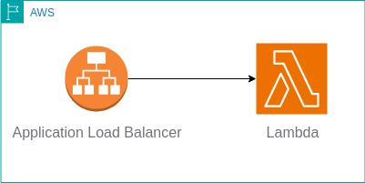

# Serverless Application: Application_Load_Balancer_with_Lambda_as_a_target

This is a Serverless application that sets up an Application Load Balancer (ALB) with a Lambda function as a target using AWS infrastructure. \
`Developer` : Divyansh Patel

## Description

This Serverless application provisions the following AWS resources:

- **VPC**: Creates a Virtual Private Cloud (VPC) with public subnets.
- **Security Group**: Sets up a security group allowing inbound traffic on port 80.
- **Application Load Balancer (ALB)**: Configures an internet-facing ALB associated with the VPC and security group.
- **Lambda Function**: Deploys a Node.js Lambda function.
- **ALB Listener and Target Group**: Defines an ALB listener on port 80 and sets up a target group with the Lambda function as the target.V
- **Lambda Permission for ALB**: Grants permission to the ALB to invoke the Lambda function.

## Usage

1. **Prerequisites**: Ensure you have the Serverless Framework installed globally on your system.

2. **Deployment**:
   - Clone this repository.
   - Navigate to the directory containing the `serverless.yml` file.
   - Run `sls deploy` to deploy the Serverless application to your AWS account.

3. **Accessing the Application**:
   - Once deployed, the output section of the deployment will provide the URL of the ALB.
   - Access the application using the provided ALB URL.

## Configuration

- Modify the `serverless.yml` file to customize the AWS resources according to your requirements.
- Update the Lambda function code and handler as per your application logic.
- Adjust security group rules, VPC settings, and other configurations as needed.

## Dependencies

- [Serverless Framework](https://www.serverless.com): Used to define and deploy AWS resources in a serverless manner.

## License

This project is licensed under the MIT License - see the [LICENSE](LICENSE) file for details.

---

Feel free to customize this README file further to include any additional information or instructions specific to your application.