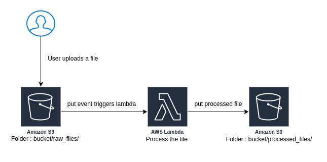

# Serverless Architecture for Automated S3 File Processing with AWS Lambda
`Developer`: Divyansh Patel

This project demonstrates a serverless architecture for processing files uploaded to an Amazon S3 bucket using AWS Lambda. The architecture ensures that when a user uploads a file to the S3 bucket, it triggers a Lambda function to process the file and store the processed file in another S3 bucket.

## Architecture Overview

1. **User Uploads a File**: A user uploads a file to an S3 bucket (`raw_files` folder).
2. **S3 Event Notification**: The S3 bucket triggers an event that invokes an AWS Lambda function.
3. **Lambda Function Execution**: The Lambda function processes the file.
4. **Processed File Storage**: The processed file is stored in another S3 bucket (`processed_files` folder).

## Prerequisites

- AWS Account
- Serverless Framework CLI
- Python 3.8
- Node.js

## Setup Instructions

### 1. Install Serverless Framework

If you haven't already, install the Serverless Framework CLI:

```bash
npm install -g serverless
```

### 2. Clone the Repository

```bash
git clone https://github.com/your-repo/serverless-file-processing.git
cd serverless-file-processing
```

### 3. Configure AWS Credentials

Ensure your AWS credentials are configured. You can use the AWS CLI to set up your credentials:

```bash
aws configure
```

### 4. Update `serverless.yml`

Replace the placeholder bucket names with your actual S3 bucket names:

```yaml
resources:
  Resources:
    RawFilesBucket:
      Type: AWS::S3::Bucket
      Properties:
        BucketName: your-raw-files-bucket-name
    ProcessedFilesBucket:
      Type: AWS::S3::Bucket
      Properties:
        BucketName: your-processed-files-bucket-name
```

### 5. Deploy the Service

Deploy the service using the Serverless Framework:

```bash
serverless deploy
```

This will create the necessary S3 buckets and Lambda function.

## File Structure

- `serverless.yml`: Configuration file for the Serverless Framework.
- `handler.py`: Python script that defines the Lambda function to process files.

## `handler.py`

The Lambda function defined in `handler.py` processes files from the raw S3 bucket and stores the processed files in another S3 bucket.

```python
import boto3
import urllib.parse

s3 = boto3.client('s3')

def process_file(event, context):
    for record in event['Records']:
        src_bucket = record['s3']['bucket']['name']
        src_key = urllib.parse.unquote_plus(record['s3']['object']['key'])
        dest_bucket = 'your-processed-files-bucket-name'
        dest_key = src_key.replace('raw_files/', 'processed_files/')
        
        try:
            copy_source = {'Bucket': src_bucket, 'Key': src_key}
            s3.copy_object(CopySource=copy_source, Bucket=dest_bucket, Key=dest_key)
            print(f'File copied from {src_key} to {dest_key}')
        except Exception as e:
            print(f'Error processing file {src_key}: {e}')
            raise e
```

## Cleanup

To remove the deployed service and free up AWS resources, run:

```bash
serverless remove
```

## Contributing

Contributions are welcome! Please open an issue or submit a pull request for any improvements or bug fixes.

## License

This project is licensed under the MIT License. See the [LICENSE](LICENSE) file for details.
```