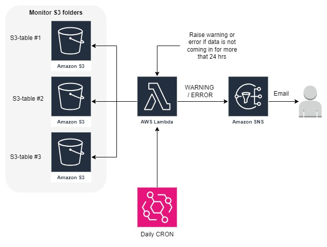

# S3-Table-Monitoring-and-Alert-System
Developer : `divyansh patel`
## Overview

The S3-Table-Monitoring-and-Alert-System is designed to monitor specific S3 buckets for any new files. If no new files are detected within a defined time period, the system will send a notification through SNS (Simple Notification Service). This ensures that data ingestion or file updates in your S3 buckets are monitored, and any disruptions are promptly alerted.

## Architecture

The system is composed of the following AWS components:

1. **Amazon S3 Buckets**: These buckets hold the data tables that need to be monitored.
2. **AWS Lambda Function**: This function is triggered daily to check for new files in the specified S3 buckets. If no new files are found within the specified time frame (24 hours), it raises a warning or error.
3. **Amazon SNS**: SNS is used to send email notifications if no new files are detected.
4. **Daily CRON**: A scheduled event that triggers the Lambda function daily.

### Diagram

## Components

### Amazon S3
Three S3 buckets (S3-table #1, S3-table #2, S3-table #3) are monitored for new file uploads.

### AWS Lambda
- **Function Name**: `monitor`
- **Trigger**: Scheduled daily CRON job
- **Environment Variables**:
  - `TOPIC_ARN`: The ARN of the SNS topic to send notifications.

### Amazon SNS
- **Topic Name**: `S3TableMonitoringNotifications`
- **Usage**: Sends email notifications to alert when no new files are detected within the 24-hour time frame.

### Daily CRON
- **Schedule**: `cron(0 0 * * ? *)` - Runs daily at midnight UTC.

## How It Works

1. **File Monitoring**: The Lambda function runs daily, checking the specified S3 buckets for new files.
2. **Alert Trigger**: If no new files are detected within the last 24 hours, the Lambda function sends a warning or error message to the SNS topic.
3. **Notification**: SNS sends an email notification to the subscribed users, alerting them of the issue.

## Setting Up

1. Deploy the serverless configuration using the Serverless Framework.
2. Ensure the S3 buckets are properly configured and contain the data tables to be monitored.
3. Subscribe to the SNS topic to receive email notifications.

## Notes

- Modify the `CRON_SCHEDULE` environment variable to change the frequency of the monitoring.
- Ensure the IAM role associated with the Lambda function has the necessary permissions to access the S3 buckets and publish to the SNS topic.

This setup helps in maintaining a robust data pipeline by ensuring timely alerts for any disruptions in the data flow.
