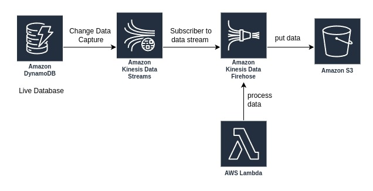

# Serverless_DynamoDB_to_S3_with_Kinesis_and_Lambda
\
This project implements a serverless architecture for processing DynamoDB change data capture using AWS services such as DynamoDB, Kinesis Data Streams, Kinesis Data Firehose, Lambda, and S3. The architecture ensures real-time data processing and storage.

## Architecture Overview

The architecture includes the following components:
- **Amazon DynamoDB**: A live database with Change Data Capture (CDC) enabled.
- **Amazon Kinesis Data Streams**: Streams that capture changes from the DynamoDB table.
- **Amazon Kinesis Data Firehose**: A delivery stream that subscribes to the Kinesis Data Stream and delivers data to S3.
- **AWS Lambda**: A Lambda function that processes data before it is delivered to S3.
- **Amazon S3**: A bucket where the processed data is stored.

## Diagram


## Prerequisites

- Node.js and npm installed
- Serverless Framework installed (`npm install -g serverless`)
- AWS CLI configured with appropriate permissions

## Deployment

1. **Clone the repository**:
   ```bash
   git clone https://github.com/yourusername/your-repo-name.git
   cd your-repo-name
   ```

2. **Install dependencies**:
   ```bash
   npm install
   ```

3. **Deploy the stack**:
   ```bash
   serverless deploy
   ```

## Project Structure

- `serverless.yml`: Configuration file for the Serverless Framework.
- `handler.py`: Python code for the Lambda function.

## Lambda Function

### process_data

Triggered by Kinesis Data Firehose to process data before it is delivered to the S3 bucket.

## Resources

The deployment creates the following AWS resources:

- DynamoDB Table: `your-dynamodb-table`
- Kinesis Data Stream: `your-kinesis-data-stream`
- Kinesis Data Firehose: `your-kinesis-data-firehose`
- Lambda Function: `processData`
- S3 Bucket: `your-s3-bucket`

## Testing

1. **Make a change in the DynamoDB table**:
   - Insert, update, or delete an item in the DynamoDB table.

2. **Verify the processing**:
   - Check the CloudWatch logs for the Lambda function to verify that the data change was processed correctly.
   - Check the S3 bucket to verify that the processed data is stored correctly.

## Cleanup

To remove the deployed resources, run:

```bash
serverless remove
```

## License

This project is licensed under the MIT License. See the `LICENSE` file for details.
