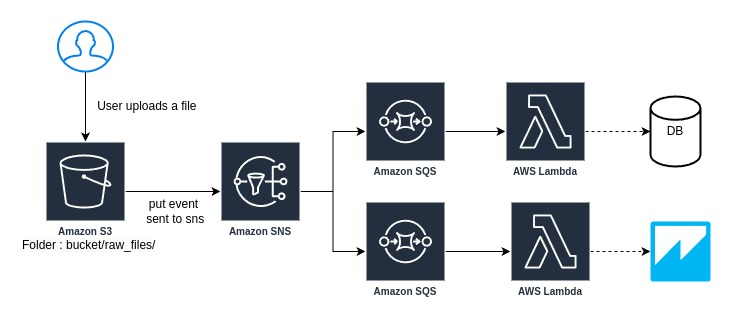

# Serverless_File_Upload_Processing_with_S3_SNS_SQS_and_AWS_Lambda
`Developer`: Divyansh Patel
 \
This project implements a serverless architecture for processing file uploads using AWS services such as S3, SNS, SQS, and Lambda. The architecture ensures scalability, reliability, and easy maintenance.

## Architecture Overview

The architecture includes the following components:
- **Amazon S3**: A bucket where users upload files.
- **Amazon SNS**: A topic that receives notifications when a file is uploaded to the S3 bucket.
- **Amazon SQS**: Two queues that subscribe to the SNS topic to receive messages.
- **AWS Lambda**: Two Lambda functions that process the messages from the respective SQS queues.

## Diagram


## Prerequisites

- Node.js and npm installed
- Serverless Framework installed (`npm install -g serverless`)
- AWS CLI configured with appropriate permissions

## Deployment

1. **Clone the repository**:
   ```bash
   git clone https://github.com/yourusername/your-repo-name.git
   cd your-repo-name
   ```

2. **Install dependencies**:
   ```bash
   npm install
   ```

3. **Deploy the stack**:
   ```bash
   serverless deploy
   ```

## Project Structure

- `serverless.yml`: Configuration file for the Serverless Framework.
- `handler.py`: Python code for the Lambda functions.

## Lambda Functions

### process_file_1

Triggered by `FileQueue1` SQS queue. This function processes messages received from the queue.

### process_file_2

Triggered by `FileQueue2` SQS queue. This function processes messages received from the queue.

## Resources

The deployment creates the following AWS resources:

- S3 Bucket: `bucket-raw-files`
- SNS Topic: `FileUploadTopic`
- SQS Queues: `FileQueue1` and `FileQueue2`
- Lambda Functions: `processFile1` and `processFile2`

## Testing

1. **Upload a file to the S3 bucket**:
   - Go to the S3 console and upload a file to the `bucket-raw-files`.

2. **Verify the processing**:
   - Check the CloudWatch logs for the Lambda functions to verify that the file upload event was processed correctly.

## Cleanup

To remove the deployed resources, run:

```bash
serverless remove
```

## License

This project is licensed under the MIT License. See the `LICENSE` file for details.
