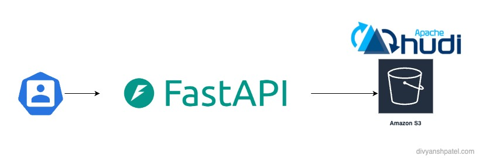

# FastAPI Hudi Data Retrieval API

## Overview

This project is a **FastAPI-based** web service designed to retrieve data from an **Apache Hudi** table stored in **Amazon S3**. The API filters data based on a provided `pk_column` and returns the results in JSON format.

## Features
- Built using **FastAPI** for high performance.
- Retrieves and filters data from an **Apache Hudi** table.
- Utilizes **Boto3** for AWS S3 integration.
- Supports **environment variable configuration** for credentials and paths.
- **Asynchronous execution** to improve API performance.

## Architecture
```
Client → FastAPI Server → Daft Hudi Reader → Amazon S3 (Hudi Table)
```

## Requirements
- Python 3.9+
- FastAPI
- Daft
- Boto3
- Python-Dotenv

## Installation
1. **Clone the Repository:**
   ```sh
   git clone <repo_url>
   cd fastapi-hudi-api
   ```
2. **Create a Virtual Environment:**
   ```sh
   python3 -m venv venv
   source venv/bin/activate  # On macOS/Linux
   venv\Scripts\activate     # On Windows
   ```
3. **Install Dependencies:**
   ```sh
   pip install -r requirements.txt
   ```
4. **Set Environment Variables:**
   Create a `.env` file and define the required AWS credentials and S3 path:
   ```ini
   DEV_AWS_REGION=your-region
   DEV_S3_HUDI_PATH=your-s3-path
   DEV_AWS_ACCESS_KEY_ID=your-access-key
   DEV_AWS_SECRET_ACCESS_KEY=your-secret-key
   ```

## Running the API
Start the FastAPI server:
```sh
uvicorn main:app --host 0.0.0.0 --port 8000 --reload
```

## API Endpoint
### **`POST /fetch_hudi_data`**
**Request Body:**
```json
{
  "pk_column": 290489
}
```
**Response:**
```json
{
  "column1": ["value1", "value2"],
  "column2": ["value3", "value4"]
}
```

## Testing the API
Once the server is running, you can access the interactive API documentation at:
- **Swagger UI:** [http://127.0.0.1:8000/docs](http://127.0.0.1:8000/docs)
- **ReDoc:** [http://127.0.0.1:8000/redoc](http://127.0.0.1:8000/redoc)

## License
This project is licensed under the MIT License.

---
This API provides an efficient way to query **Apache Hudi** tables stored in **AWS S3** with FastAPI. 🚀
